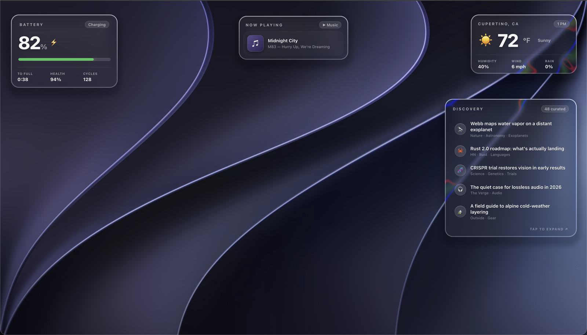

# Liquid Glass for Übersicht

A reusable Apple-style **Liquid Glass** renderer for [Übersicht](https://tracesof.net/uebersicht/)
widgets. Drop in one widget (`glass.widget`) and any of your other widgets can sit on real frosted
glass that refracts your desktop wallpaper, with one WebGL context shared across all of them.

This is the engine behind [liquid-glass-weather](https://github.com/sa1emie/liquid-glass-weather) and
[liquid-glass-discovery](https://github.com/sa1emie/liquid-glass-discovery), pulled out so you can use
it on your own widgets.



## Why it's a shader and not CSS

The common web "liquid glass" recipe is an SVG displacement filter run through `backdrop-filter`.
That's Chromium-only, and Übersicht renders in WebKit, where it quietly degrades to a flat blur that
can't see the desktop at all. So the refraction here is a small WebGL fragment shader instead:

- A signed-distance rounded rectangle for crisp, anti-aliased edges at Retina resolution.
- Refraction concentrated at the rim, so the center stays clear and only the edge bends the wallpaper.
- Chromatic aberration on that edge for the Liquid Glass color fringe.
- A specular rim, a top highlight, and a soft drop shadow.

Übersicht can't read the live desktop, so `glass.widget` extracts the dark-appearance frame of your
current macOS wallpaper with ImageIO (`swift`) and the shader maps it to each card's position on
screen, so the glass lines up with what's actually behind it.

## One context, many cards

`glass.widget` owns the WebGL so your widgets don't have to. They just publish where their card is,
and one renderer draws the glass under all of them. That's a fixed cost no matter how many widgets
opt in — one base canvas for the cards, plus a second canvas for expand panels (see below).

Rather than redraw every frame, the renderer tracks each card's position, hover, and size and only
touches the GPU when something actually changes, so an idle desktop costs next to nothing.

### Expand panels

Widgets that open a modal (a click-to-expand reader, a full forecast) register that panel on a second
list, `window.__glassModalRects`. It draws on a top canvas above your other widgets and paints a
dimmed backdrop behind itself, so the panel reads as glass floating over a darkened desktop. Return
`null` from the panel's `getEl` while it's closed and the backdrop fades out with it.

## Usage

1. Copy both widgets into your Übersicht widgets folder:

   ```bash
   WIDGETS="$HOME/Library/Application Support/Übersicht/widgets"
   cp -R glass.widget example.widget "$WIDGETS/"
   ```

2. In any widget you want glassed, drop its CSS background and register its card element:

   ```jsx
   import { css, React } from "uebersicht";

   function MyWidget() {
     const ref = React.useRef(null);
     React.useEffect(() => {
       const item = { getEl: () => ref.current, radius: 22 };
       window.__glassRects = (window.__glassRects || []);
       window.__glassRects.push(item);
       return () => {
         const a = window.__glassRects;
         const i = a.indexOf(item);
         if (i >= 0) a.splice(i, 1);
       };
     }, []);
     return <div ref={ref} className={card}>…your content…</div>;
   }
   export const render = () => <MyWidget />;
   ```

   The card needs `pointer-events: auto` and a corner `radius` that matches what you pass. That's all
   there is to it: `glass.widget` reads the element's position every frame, so it follows hover, resize,
   and expand.

`example.widget` is a complete working version of the above. Delete it once you've wired your own.

### Registration API

`window.__glassRects` (cards) and `window.__glassModalRects` (expand panels) are arrays of
`{ getEl, radius, hover }`:

| Field | Type | Meaning |
|---|---|---|
| `getEl` | `() => HTMLElement \| null` | Returns your card element (return `null` when it shouldn't be drawn). |
| `radius` | `number` | Corner radius in CSS px, to match your card's `border-radius`. |
| `hover` | `boolean` (optional) | Set `false` on non-interactive cards so they don't brighten under the cursor. Defaults to on. |

Register a modal exactly like a card, but push it onto `window.__glassModalRects` instead.

## Requirements

- macOS + [Übersicht](https://tracesof.net/uebersicht/)
- Xcode Command Line Tools for `swift` (`xcode-select --install`)

Using a static or third-party wallpaper? Put a `wallpaper.path` file in `glass.widget/` containing an
absolute path to any image, and the glass will refract that instead of the detected wallpaper.

## License

MIT
